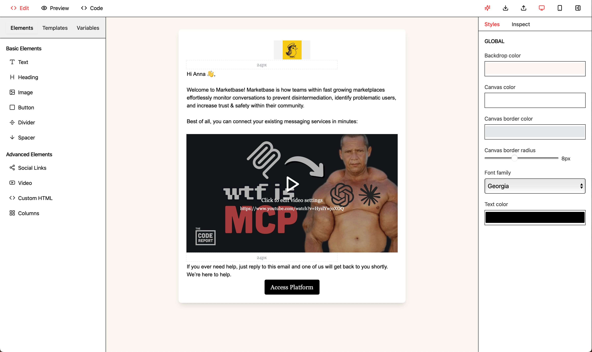
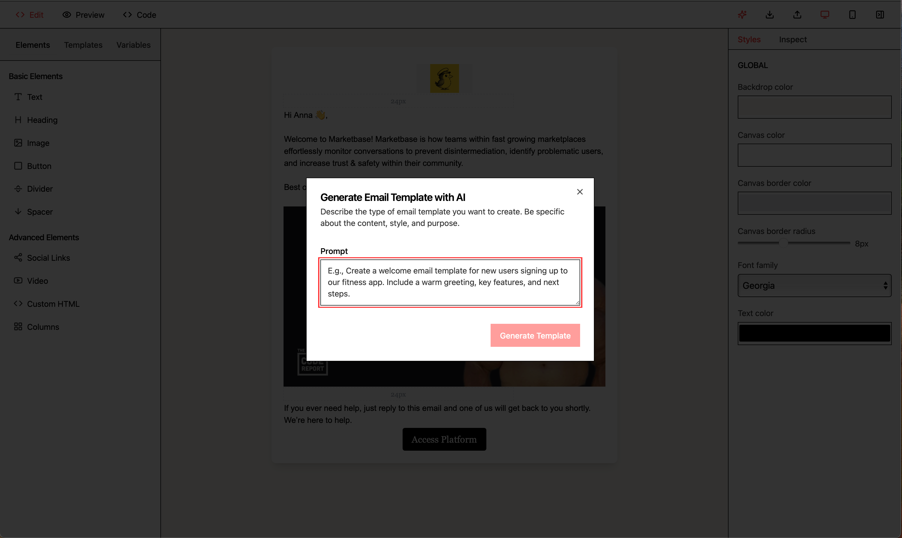

# enveloope - AI Email Editor



Build beautiful email templates without the headache. Our drag-and-drop editor fits right into your React project, no matter what your layout looks like.

> Hey! We're still polishing things up. Not quite production-ready yet, but we're getting close! 👀

## Features

- 🎨 Drag-and-drop interface
- 📱 Mobile-responsive design
- 🎯 Live preview
- 💅 Customizable styles
- 🔌 Easy integration
- 🤖 AI-powered template generation
- 📦 Export to HTML/JSON
- 📥 Import from HTML/JSON

## Installation

```bash
npm install @posthoot/enveloope
```

## Quick Start

```tsx
import { EmailEditor } from '@posthoot/enveloope';

function App() {
  const handleSave = (elements) => {
    console.log('Saving elements:', elements);
  };

  const handlePreview = (html) => {
    console.log('Preview HTML:', html);
  };

  return (
    <EmailEditor
      onSave={handleSave}
      onPreview={handlePreview}
      initialBodySettings={{
        backgroundColor: '#ffffff',
        fontFamily: 'Arial, sans-serif',
        textColor: '#000000',
        width: 600,
        padding: 20,
        lineHeight: 1.5,
        backdropColor: '#f7f7f7'
      }}
    />
  );
}
```

## Available Elements

The editor supports the following elements:

- **Text**: Regular paragraphs with customizable fonts and styles
- **Heading**: H1-H6 headings with various styles
- **Image**: Image elements with alt text and alignment options
- **Button**: Call-to-action buttons with customizable styles
- **Divider**: Horizontal lines with different styles
- **Spacer**: Vertical spacing elements
- **Columns**: Multi-column layouts
- **HTML**: Custom HTML snippets
- **Social**: Social media links with icons
- **Video**: Embedded video players (YouTube, Vimeo)

## Element Properties

### Common Properties
All elements share these base properties:
```typescript
interface BaseSettings {
  width?: 'auto' | number;
  height?: 'auto' | number;
  verticalAlignment?: 'top' | 'middle' | 'bottom';
  horizontalAlignment?: 'left' | 'center' | 'right';
  backgroundColor?: string;
  padding?: {
    top: number;
    right: number;
    bottom: number;
    left: number;
  };
  hideOnMobile?: boolean;
  hideOnDesktop?: boolean;
}
```

### Video Element
```typescript
interface VideoElement {
  settings: {
    embedUrl: string;        // URL of the video
    thumbnailUrl: string;    // Thumbnail image URL
    altText: string;        // Alternative text
    width: 'auto' | number; // Width (auto or specific pixels)
    height: 'auto' | number; // Height (auto or specific pixels)
  }
}
```

## AI Template Generation



The editor supports AI-powered template generation:

```typescript
const handleGenerateWithAI = async (prompt: string) => {
  const result = await generateEmailTemplate(prompt);
  return result;
};

<EmailEditor
  onGenerateWithAI={handleGenerateWithAI}
  // ... other props
/>
```

## Export/Import

### Export
```typescript
// Export as HTML
const handleExport = (format: 'html') => {
  // Returns complete HTML with styles
};

// Export as JSON
const handleExport = (format: 'json') => {
  // Returns template structure
};
```

### Import
```typescript
// Import from HTML or JSON
const handleImport = (file: File) => {
  // Accepts .html or .json files
};
```

## Styling

The editor uses Tailwind CSS for styling. You can customize the appearance by:

1. Modifying the theme in your Tailwind config
2. Overriding CSS classes
3. Using the built-in style controls in the editor

## Development

```bash
# Install dependencies
npm install

# Start development server
npm run dev

# Build package
npm run build

# Run tests
npm test
```

## Props

### EmailEditor Props
```typescript
interface EmailEditorProps {
  onSave?: (elements: EmailElement[]) => void;
  onPreview?: (html: string) => void;
  initialElements?: EmailElement[];
  initialBodySettings?: Partial<BodySettings>;
  onGenerateWithAI?: (prompt: string) => Promise<{
    elements: EmailElement[];
    bodySettings?: Partial<BodySettings>;
  }>;
}
```

### BodySettings
```typescript
interface BodySettings {
  backgroundColor: string;
  fontFamily: string;
  textColor: string;
  width: number;
  padding: number;
  lineHeight: number;
  backdropColor: string;
  borderColor?: string;
  borderRadius?: number;
}
```

## Contributing

We welcome contributions! Please see our contributing guidelines for details.

## License

MIT © [Posthoot](https://posthoot.com) 